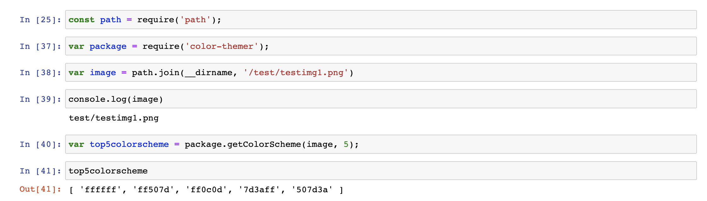

# Welcome to color-themer's documentation!

color-themer is a library created to help resolve the pain points frequently experienced when developing with RGB colors. Its main purpose is to generate a color scheme based on an image inputted by the user.

## Installation
Thanks for your interest in color-themer!
Before you get started, ensure that you have node.js and npm installed.
Then, to install the library, run `npm install color-themer`

## Library Usage
Currently, there is one public method that users can call to access the library's functionality.
`getColorScheme` takes an image filepath and the number of colors wanted in the theme, and outputs the top n most popular colors in the image.


```eval_rst
.. js:autofunction:: getColorScheme 
```

## Example
To use the above method, find an image and its path. The method requires a string input for path. The output of the method is the color codes in array, which users can later extract and use in their HTML elements, etc. 
The below Jupyter notebook screenshot shows the example usage for the below image: 


